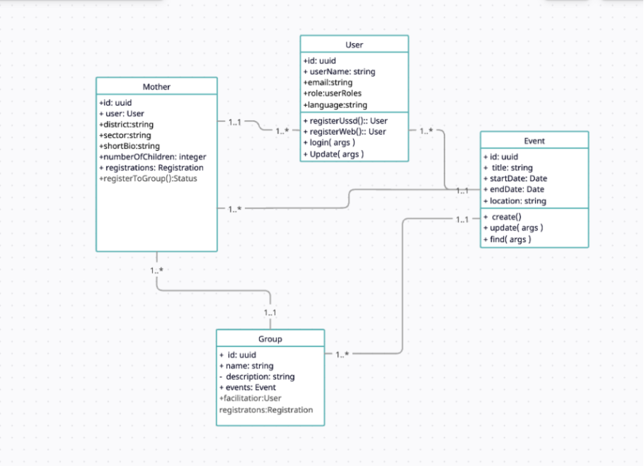

# EmpowerHer Backend

EmpowerHer is a platform that connects support groups for adolescent mothers, enabling registration and participation in group activities. This repository contains the backend (Strapi) powering the EmpowerHer platform.

## Installation & Running (Step-by-Step)

1. **Clone the repository:**
   ```bash
   git clone https://github.com/CynthiaUmuhire/EmpowerHer-Backend.git
   cd EmpowerHer-Backend
   ```
2. **Create environment file:**
   - Copy `.env.example` to `.env` and fill in the required values.
3. **Install dependencies:**
   ```bash
   pnpm install
   ```
4. **Run the backend server:**
   ```bash
   pnpm dev
   ```
5. **Access the app:**
   - The backend will run at the URL shown in your terminal (e.g., `http://localhost:1337`).

## Related Files

- `src/` — Main backend source code
- `config/` — Configuration files
- `database/` — Database migrations
- `public/` — Public assets
- `types/` — Type definitions
- `README.md` — This documentation

## Demo Video

[](https://www.youtube.com/watch?v=DEMO_VIDEO_ID)

> **Note:** The demo focuses on core functionalities such as group management, event participation, and USSD flows. Sign-up and sign-in are briefly shown but not the main focus.

## Deployed Version

- **Live Backend:** [Strapi Cloud Deployment](https://cloud.strapi.io)
- **Frontend Demo:** [EmpowerHer Frontend](https://empowerher-frontend.vercel.app) *(if available)*

> If you need an installable package (apk, exe, etc.), please check the releases section or contact the maintainer.

## Class Diagram



## Deployment Plan

1. Version control: GitHub for tracking code changes.
2. Hosting: [Strapi Cloud](https://cloud.strapi.io)


